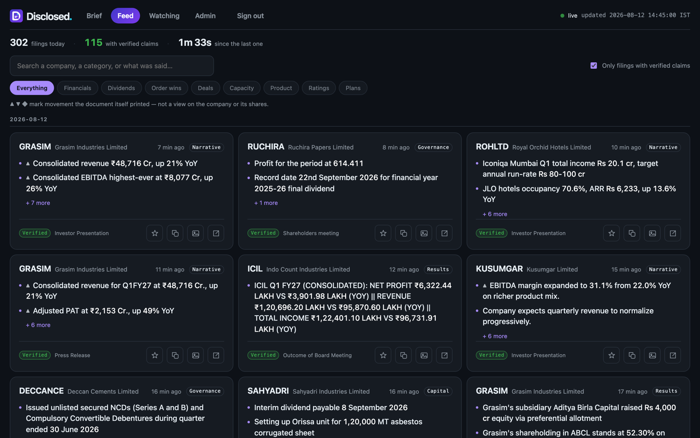
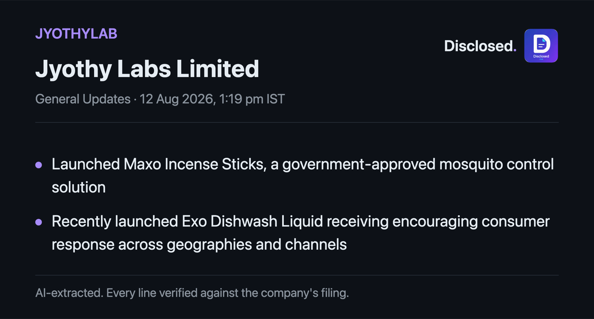
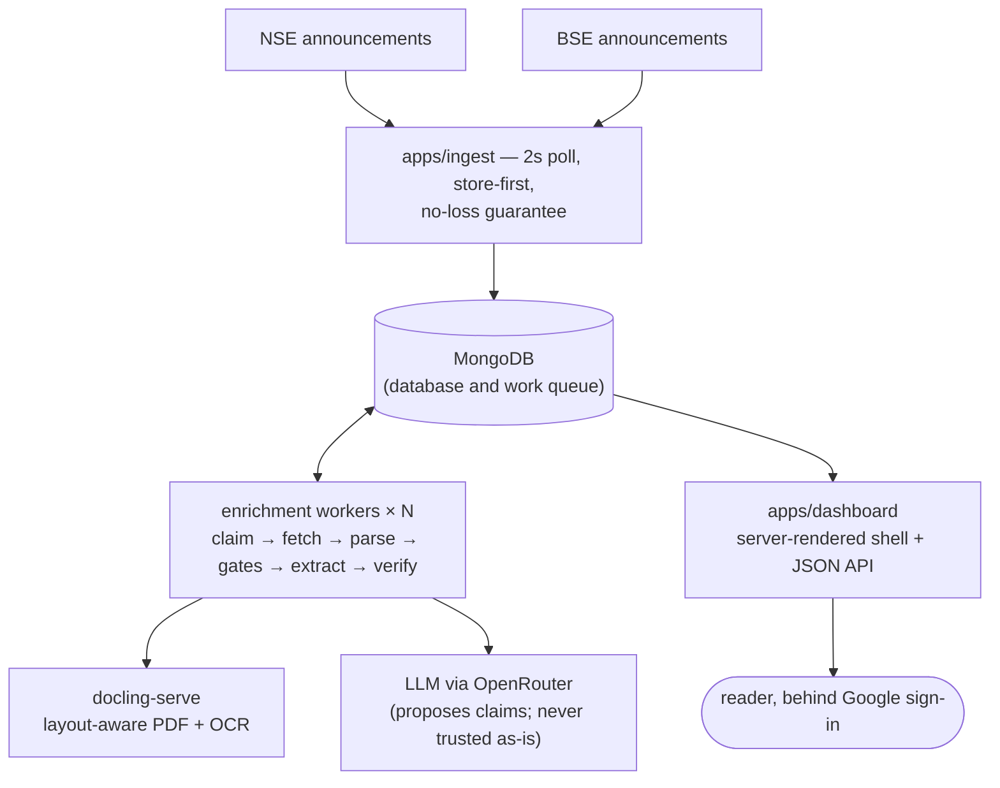

# Disclosed

**Real-time NSE/BSE corporate filings, where every published claim is verified
character-for-character against the source document.**

[](https://github.com/pruthvi-itribe/disclosed/actions/workflows/ci.yaml)
[](LICENSE)

A listed company files hundreds of documents a day across India's exchanges —
board outcomes, quarterly results, orders won, auditors' warnings — most of it
buried in PDFs nobody has time to read. Disclosed reads them in real time,
extracts what the company actually said, and shows each claim **with the exact
sentence it came from**.



## The one rule

AI proposes; the machine verifies; nothing unverifiable ships.

A language model reads each document and proposes claims. Every claim is then
**string-matched against the document's own text** — no match, no claim. No
derived arithmetic (no computed margins or growth rates the filing didn't
print), no sentiment scores, no ratings. Where a filing printed a direction
word beside a figure, the card shows a neutral mark that follows the figure —
the product has no view on any company or its shares, and says so.

The measured reality that makes this rule load-bearing: on live filings the
gate routinely discards model-proposed claims whose numbers or periods are not
in the quoted span — plausible-sounding hallucinations that would otherwise
ship as facts about named listed companies.

## What a reader gets

- **Filing in the feed ~30 seconds** after the exchange disseminates it;
  verified insights follow at a median of ~2 minutes.
- **The Brief** — the day as a swipeable deck, one company per card,
  stories-style on a phone.
- **The Feed** — every filing, searchable, filtered by topic, each insight
  expandable to its verbatim source quote.
- **Watchlists** — follow companies; a "Watching" view of only their filings.
- **Company pages** — one filer's history, categories, and what it said it
  plans.
- **Shareable posts** — one tap copies a WhatsApp-ready text or a branded
  image card; both carry the line *"AI-extracted. Every line verified against
  the company's filing."*

<p align="center">
  
</p>

## How it works



Three NestJS apps over one MongoDB, no message broker — the filing document
carries its own work state and workers claim jobs with a single atomic update:

| App | Role |
| --- | --- |
| `apps/ingest` | Polls NSE every 2 s when the market is active. Stores first, alerts second; slow work never blocks the next filing. Carries a measured no-loss guarantee ([details](docs/internals.md#the-no-loss-guarantee)). Hosts enrichment worker #1. |
| `apps/ingest` (worker entry) | `dist/apps/ingest/src/enrichment.main` — additional workers, scaled horizontally. Each document: fetch → parse (routing between a fast text parser and [Docling](https://github.com/docling-project/docling-serve) for tables/scans) → eligibility gates → two model lanes in parallel → the verbatim gate. |
| `apps/dashboard` | The product. Serves a self-contained page (no CDN, no external fonts, no analytics — the signed-in app makes zero foreign-origin requests) and the JSON API behind a session guard. |

Documents that can't earn their model call don't get one: covering letters,
legal papers, shared multi-company pages, newspaper reprints and meeting
intimations are refused **with the reason recorded** — "nothing was looked
for" and "nothing was found" are different facts and never render the same.

## Quick start

Requires Node 20+, Docker, and ~15 GB of disk (the Docling image is large).

```bash
git clone https://github.com/pruthvi-itribe/disclosed && cd disclosed
docker compose up -d          # MongoDB :27117, Redis, docling-serve :5501
cp .env.example .env          # defaults work; see Configuration below
npm install --legacy-peer-deps

npm run start:dev             # the ingest + worker #1 (starts polling NSE)
npm run start:dashboard       # the app on http://127.0.0.1:7717
```

Without any keys the pipeline boots, polls and persists, and the dashboard
runs with local email/password auth — register any account and read. Two
optional integrations:

- **Claim extraction** — set `CLAIM_PROVIDER=openrouter` and an OpenRouter
  key; without it, filings are stored and shown without model-extracted
  claims.
- **Google sign-in** — create a Firebase project and set
  `FIREBASE_PROJECT_ID` + `FIREBASE_WEB_API_KEY`; the sign-in page switches to
  Google-only. No service-account key is needed (token verification is a
  signature check against Google's public certificates). Until the keys exist,
  the local email+password path serves.

More workers, when the queue grows:

```bash
npm run build
node dist/apps/ingest/src/enrichment.main   # one per additional worker
```

## Configuration

Everything is environment variables, read in exactly one place per app and
validated at startup — a bad value stops the process naming the key. The
complete annotated list lives in [`.env.example`](.env.example); the ones that
matter first:

| Variable | Default | Purpose |
| --- | --- | --- |
| `MONGO_URI` | `mongodb://localhost:27117/turret` | Storage and work queue. |
| `DASHBOARD_PORT` | `7717` | Always bound to `127.0.0.1`; put a proxy in front for the internet. |
| `PUBLIC_ORIGIN` | loopback | The one origin allowed to POST. Must be the public https origin behind a proxy. |
| `TRUST_PROXY` | off | Hop count of trusted proxies. Off = today's behavior; see [deploy docs](docs/deploy-kubernetes.md) before exposing publicly. |
| `AUTH_MODE` | follows keys | `firebase` when the two Firebase keys are set, else `local`. |
| `CLAIM_PROVIDER` / `CLAIM_MODEL` | unset | The extraction model. The pipeline runs without it. |
| `DOCLING_URL` | unset | The layout parser. Compose serves it at `http://127.0.0.1:5501`. Unset ⇒ the fast parser reads everything and each filing records that it did. |
| `ADMIN_ENABLED` | follows host | The operator panel. Built only on a local, non-production host unless forced — [why](docs/internals.md#the-admin-view-is-local-only). |
| `OPERATOR_WATCHLIST` | empty | Symbols for the Telegram alert lane. Empty means firehose (~388 messages/day measured) — the boot log warns. |

## The rules the code lives by

These are enforced by tests, not aspiration ([CLAUDE.md](CLAUDE.md) is the
authoritative list):

- **The verbatim gate** — nothing reaches a reader that wasn't string-matched
  against the source document.
- **Attribution before publication** — a span being *in* a document doesn't
  make it *about* the filer; multi-company documents are refused, not guessed
  at.
- **Fail loudly** — no silent fallbacks. Every skip, refusal, parse downgrade
  and outage is recorded on the filing and visible in the operator panel.
- **IST is server-owned** — the browser never formats a timestamp.
- **Exchange text is untrusted** — no `innerHTML` anywhere; every DOM node is
  built safely; links only through an allow-listed scheme check.
- **Self-contained pages** — the signed-in app requests nothing from any
  foreign origin. The two signed-out pages make exactly one exception:
  Google's pinned sign-in SDK.
- **Measured constants** — every threshold in the code cites the sweep of
  real data that placed it, in a comment beside the constant, so the next
  editor re-measures instead of re-guessing.

## Tests

```bash
npm test              # ~5,600 Jest tests, no network, ~13s
npm run lint
npx tsc --noEmit -p tsconfig.json
npx playwright test   # ~125 browser tests; needs the dashboard running with AUTH_MODE=local
```

Coverage thresholds are enforced in `jest.config.js`. Components with silent
failure modes additionally carry mutation harnesses under `tools/mutation/` —
each breaks the implementation one way at a time and asserts the tests catch
it ([details](docs/internals.md#mutation-harnesses)).

There is deliberately no test bypass in the server: the browser suite
registers a throwaway account through the real register route and deletes it
afterwards.

## Deployment

- **Docker / single host:** [`docs/deploy-digitalocean.md`](docs/deploy-digitalocean.md)
  — Dockerfile, compose, Caddy, backups.
- **Kubernetes:** [`docs/deploy-kubernetes.md`](docs/deploy-kubernetes.md) and
  the manifests in [`k8s/`](k8s/) — ingest (single replica, Recreate),
  workers (scaled to the measured results-season peak), dashboard behind a
  Caddy sidecar, Docling on its own node with the memory lessons of a real
  OOM baked in as config. CI builds and deploys via the workflows in
  [`.github/workflows/`](.github/workflows/).

## Going deeper

- [`docs/internals.md`](docs/internals.md) — the no-loss guarantee's three
  mechanisms and the measured NSE behavior that shaped them; the operator
  alert taxonomy; why the dashboard is a separate application; the admin
  gate's two-signal rule; running Docling outside compose.
- [`docs/ui-components.md`](docs/ui-components.md) — every UI component's
  name, for precise conversations about the interface.
- [`docs/measurements/`](docs/measurements/) — the audits and sweeps behind
  the constants (processing audit, enrichment speed sweep, header-tier and
  date-spelling investigations).
- [`docs/superpowers/specs/`](docs/superpowers/specs/) — the original design
  documents.

## License

[MIT](LICENSE) © 2026 Pruthvi Raj Eranti

Disclosed reports what companies file and shows where they said it. It has no
view on any company or security, publishes no recommendations, and is not
investment advice.
